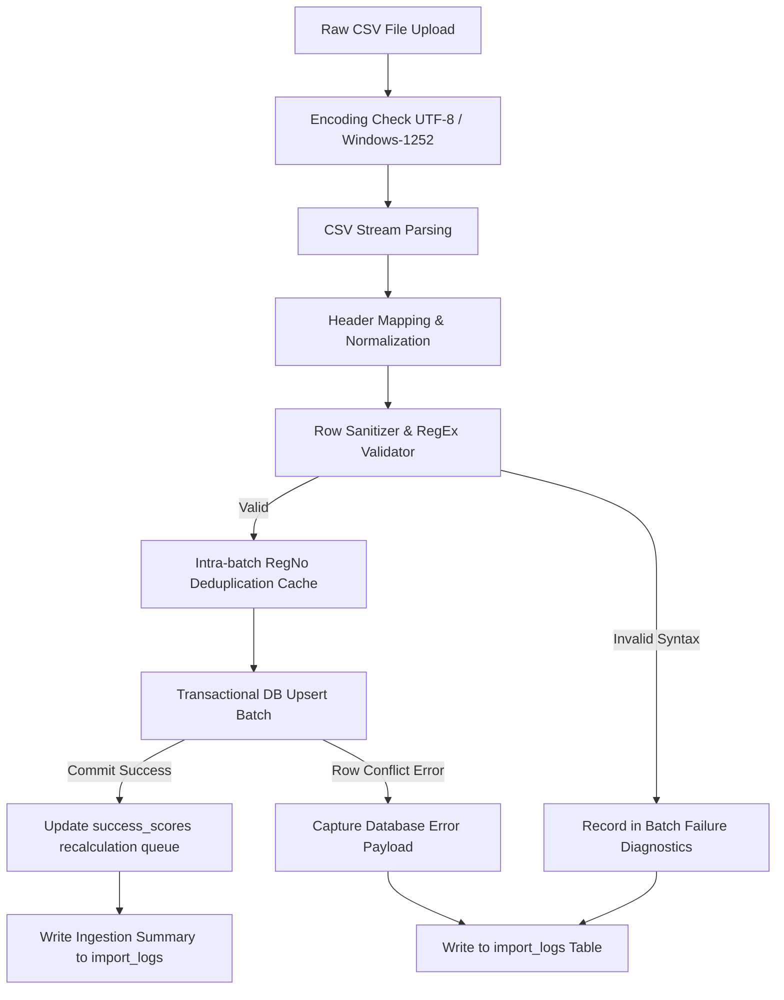

# CampusPulse CSV Ingestion & Cleansing Specification

## 1. Overview
The **CampusPulse CSV Ingestion Engine** provides a resilient data-cleansing pipeline designed to ingest legacy Indian college ERP/SIS exports, RFID attendance dumps, and CIE examination spreadsheets into PostgreSQL/Supabase.

The engine guarantees:
1. **Strict Deduplication on `reg_no`** (e.g., `241FA18067`).
2. **Schema Validation & Type Coercion** with automated outlier clamping.
3. **Safe Upsert / Merge Logic** preventing duplicate profile creation.
4. **Persistent Audit Logging** into `import_logs` (recording total processed, succeeded, failed, and exact row-level JSON error diagnostics).

---

## 2. Supported Ingestion Streams

| Stream ID | Source Type | Key Columns | Primary Entity |
| :--- | :--- | :--- | :--- |
| `sis_students` | Student Master Dump | `reg_no, full_name, email, section, dept, year, cgpa, backlogs, leetcode_url, github_url` | `profiles`, `students` |
| `academic_cie` | Internal Assessment | `reg_no, subject, f1, f2, semester_exam, max_marks` | `academic_marks` |
| `rfid_attendance` | Biometric Logs | `reg_no, subject, held, attended, month` | `attendance` |
| `placement_records`| TPO Placement Tracker | `company, year, students_placed, total_eligible, package_lpa` | `placements` |

---

## 3. Cleansing & Validation Rules

### 3.1. Identifier Sanitization (`reg_no`)
* **Standard Pattern**: `^[0-9]{3}[A-Z]{2}[0-9]{5}$` (e.g., `241FA18067`, `241FA04070`).
* **Transformation**:
  * Trim all leading/trailing whitespace.
  * Strip inadvertent internal spaces, tabs, and hyphens (`241 FA 18067` → `241FA18067`).
  * Force uppercase normalization.
* **Deduplication Strategy**:
  * **Intra-batch deduplication**: If the CSV contains duplicate `reg_no` entries, the latest occurrence by row index is merged with prior non-null fields.
  * **Inter-database upsert**: `ON CONFLICT (reg_no) DO UPDATE SET ...` updating metrics without overwriting primary keys or orphaned relations.

### 3.2. Quantitative Bounds & Clamping

| Field | Range / Rule | Outlier / Messy Data Handling Strategy |
| :--- | :--- | :--- |
| `cgpa` | `0.00` – `10.00` | If value is entered as percentage (e.g., `85.4%`), divide by `9.5` (standard AICTE/VTU conversion) or clamp to `10.00`. |
| `backlogs` | Integer $\ge 0$ | Coerce empty string/`NULL` to `0`. If negative, set to `0` and record warning. |
| `f1`, `f2` | `0.0` – `10.0` | CIE Formative assessments are strictly out of 10. If out of 20/25, rescale to 10. `NULL` allowed for absent/upcoming. |
| `attendance.attended` | $0 \le \text{attended} \le \text{held}$ | If `attended > held`, clamp `attended = held` and log anomaly to `import_logs`. |
| `held` | Integer $\ge 0$ | If `0`, `attendance_pct` defaults to `0.00%`. |
| `placement_readiness` | `0.00` – `100.00` | Clamp outliers. |
| `skills` | `0.0` – `10.0` | Default missing to `5.0`. |

---

## 4. Ingestion Workflow & Pipeline



---

## 5. TypeScript Specification & Schema (Zod)

```typescript
import { z } from 'zod';

// Registration Number standard validator for Indian Universities
export const RegNoSchema = z
  .string()
  .transform((val) => val.trim().toUpperCase().replace(/[\s-]/g, ''))
  .refine((val) => /^[0-9]{3}[A-Z]{2}[0-9]{5}$/.test(val), {
    message: 'Invalid Registration Number format. Expected format: 241FA18067',
  });

// Student Master Row Schema
export const StudentCsvRowSchema = z.object({
  reg_no: RegNoSchema,
  full_name: z.string().min(2, 'Name must be at least 2 characters').trim(),
  email: z.string().email().optional().or(z.literal('')),
  section: z.enum(['A', 'B', 'C', 'D']),
  dept_code: z.enum(['CSE', 'ECE', 'AIDS', 'IT', 'MECH']).default('CSE'),
  year: z.coerce.number().int().min(1).max(5).default(3),
  cgpa: z.coerce
    .number()
    .transform((val) => {
      if (val > 10.0 && val <= 100.0) return Number((val / 9.5).toFixed(2)); // Percentage to CGPA conversion
      return Math.min(10.0, Math.max(0.0, val));
    })
    .default(0.0),
  backlogs: z.coerce.number().int().nonnegative().default(0),
  leetcode_url: z.string().url().optional().or(z.literal('')).nullable(),
  codechef_url: z.string().url().optional().or(z.literal('')).nullable(),
  linkedin_url: z.string().url().optional().or(z.literal('')).nullable(),
  github_url: z.string().url().optional().or(z.literal('')).nullable(),
});

// CIE Marks Row Schema
export const AcademicMarksCsvRowSchema = z.object({
  reg_no: RegNoSchema,
  subject: z.string().min(2).trim(),
  f1: z.coerce.number().min(0).max(10).optional().nullable(),
  f2: z.coerce.number().min(0).max(10).optional().nullable(),
  semester_exam: z.coerce.number().min(0).max(100).optional().nullable(),
  max_marks: z.coerce.number().positive().default(100.0),
});

// Attendance Log Row Schema
export const AttendanceCsvRowSchema = z
  .object({
    reg_no: RegNoSchema,
    subject: z.string().min(2).trim(),
    held: z.coerce.number().int().nonnegative(),
    attended: z.coerce.number().int().nonnegative(),
    month: z.string().default('Overall'),
  })
  .transform((row) => ({
    ...row,
    // Automatic clamping to guarantee attended <= held
    attended: Math.min(row.attended, row.held),
  }));

export interface IngestionResult {
  source: string;
  total_rows: number;
  rows_ok: number;
  rows_failed: number;
  errors: Array<{
    row: number;
    reg_no?: string;
    error: string;
  }>;
}
```

---

## 6. Audit & Logging Representation (`import_logs`)

Whenever an import batch finishes, a row is inserted into `public.import_logs`:

```sql
INSERT INTO public.import_logs (source, rows_ok, rows_failed, errors)
VALUES (
  'sis_students_batch_import.csv',
  118,
  2,
  '[
    {"row": 14, "reg_no": "241FA18099", "error": "Section X not recognized; skipped."},
    {"row": 42, "reg_no": "241FA04070", "error": "Duplicate in batch: row 42 merged with row 12"}
  ]'::jsonb
);
```

This guarantees 100% visibility for administrators and audits the historical provenance of every data point in CampusPulse.
